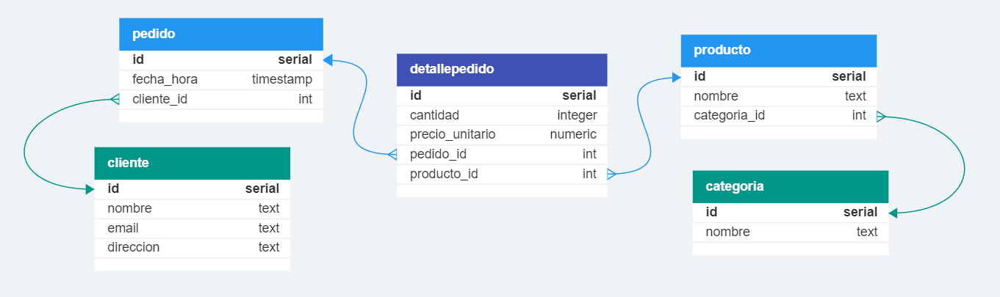

**Modelo Conceptual** 🌟

- **Entidades:**
  - Cliente
  - Categoría
  - Producto
  - Pedido
  - Detalle de Pedido

- **Relaciones:**
  - Un cliente puede realizar varios pedidos.
  - Un pedido puede contener varios productos.
  - Un producto pertenece a una categoría.

**Modelo Lógico** 📝

- **Tablas:**
  - Tabla `clientes`
    - Campos: 
      - id (Clave Primaria)
      - nombre
      - email
      - direccion
  - Tabla `categorias`
    - Campos:
      - id (Clave Primaria)
      - nombre
  - Tabla `productos`
    - Campos:
      - id (Clave Primaria)
      - nombre
      - categoria_id (Clave Foránea)
  - Tabla `pedidos`
    - Campos:
      - id (Clave Primaria)
      - fecha_hora
      - cliente_id (Clave Foránea)
  - Tabla `detalles_pedidos`
    - Campos:
      - id (Clave Primaria)
      - cantidad
      - precio_unitario
      - pedido_id (Clave Foránea)
      - producto_id (Clave Foránea)

**Modelo Físico** 💽

- **Definiciones SQL:**

```sql
-- Crear la tabla "clientes"
CREATE TABLE clientes (
    id serial PRIMARY KEY,
    nombre text,
    email text,
    direccion text
);

-- Crear la tabla "categorias"
CREATE TABLE categorias (
    id serial PRIMARY KEY,
    nombre text
);

-- Crear la tabla "productos"
CREATE TABLE productos (
    id serial PRIMARY KEY,
    nombre text,
    categoria_id int REFERENCES categorias(id)
);

-- Crear la tabla "pedidos"
CREATE TABLE pedidos (
    id serial PRIMARY KEY,
    fecha_hora timestamp,
    cliente_id int REFERENCES clientes(id)
);

-- Crear la tabla "detalles_pedidos"
CREATE TABLE detalles_pedidos (
    id serial PRIMARY KEY,
    cantidad integer,
    precio_unitario numeric(10,2),
    pedido_id int REFERENCES pedidos(id),
    producto_id int REFERENCES productos(id)
);

**Diagrama Entidad Relacion** 💻

